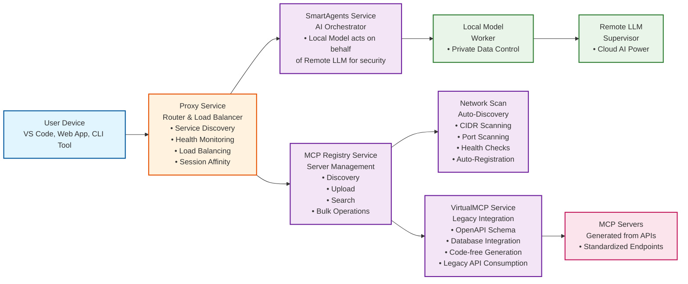

# SUSE AI Universal Proxy

A comprehensive platform for managing and proxying Model Context Protocol (MCP) servers, providing scalable AI service orchestration across multiple microservices.

## ✨ Key Features

- **Scalable Routing**: Session-aware load balancing and routing to MCP server instances
- **Lifecycle Management**: Automated deployment, scaling, and teardown of AI services
- **Registry Management**: Comprehensive MCP server registry with discovery, upload, and search capabilities
- **Enterprise Integration**: Built-in authentication, observability, and security features
- **Multi-Provider Support**: Seamless integration with various AI providers and local models
- **Kubernetes-Native**: Designed for cloud-native deployments with Helm charts and StatefulSets
- **Plugin Architecture**: Extensible microservices framework for pluggable AI capabilities

## 🚀 Quick Start

### Local Development Setup
```bash
# 1. Start the proxy service
cd suse-ai-up-proxy && go run cmd/service/main.go

# 2. Start SmartAgents with proxy registration (now in separate repository)

# 3. Test the setup
curl http://localhost:8911/plugins/services
curl http://localhost:8911/v1/models
```

### MCP Server Example with Authentication

Create and test a secure sequential thinking MCP server:

```bash
# 1. Start the proxy service
cd suse-ai-up-proxy && go run cmd/service/main.go

# 2. Create authenticated sequential thinking adapter
curl -X POST http://localhost:8911/adapters \
  -H "Content-Type: application/json" \
  -d '{
    "name": "sequential-thinking",
    "connectionType": "LocalStdio",
    "mcpClientConfig": {
      "mcpServers": {
        "sequential-thinking": {
          "command": "npx",
          "args": ["-y", "@modelcontextprotocol/server-sequential-thinking"]
        }
      }
    },
    "authentication": {
      "required": true,
      "type": "bearer",
      "token": "my-secure-token-123"
    },
    "description": "Authenticated sequential thinking MCP server"
  }'

# 3. Test without authentication (should fail)
curl -X POST http://localhost:8911/adapters/sequential-thinking/mcp \
  -H "Content-Type: application/json" \
  -d '{"jsonrpc": "2.0", "id": 1, "method": "initialize", "params": {"protocolVersion": "2024-11-05", "capabilities": {}, "clientInfo": {"name": "test-client", "version": "1.0"}}}'

# 4. Test with authentication (should succeed)
curl -X POST http://localhost:8911/adapters/sequential-thinking/mcp \
  -H "Content-Type: application/json" \
  -H "Authorization: Bearer my-secure-token-123" \
  -d '{"jsonrpc": "2.0", "id": 1, "method": "initialize", "params": {"protocolVersion": "2024-11-05", "capabilities": {}, "clientInfo": {"name": "test-client", "version": "1.0"}}}'

# 5. List available tools
curl -X POST http://localhost:8911/adapters/sequential-thinking/mcp \
  -H "Content-Type: application/json" \
  -H "Authorization: Bearer my-secure-token-123" \
  -H "mcp-session-id: YOUR_SESSION_ID" \
  -d '{"jsonrpc": "2.0", "id": 2, "method": "tools/list"}'
```

## 🏗️ Architecture Overview

```
┌─────────────────────────────────────────────────────────────────┐
│                    SUSE AI Universal Proxy                       │
│  ┌─────────────────────────────────────────────────────────────┐ │
│  │                    Plugin Service Framework                 │ │
│  │  ┌─────────────────┐  ┌─────────────────┐  ┌─────────────┐  │ │
│  │  │   SmartAgents   │  │    Registry     │  │ VirtualMCP  │  │ │
│  │  │   Service       │  │   Service       │  │  Service    │  │ │
│  │  └─────────────────┘  └─────────────────┘  └─────────────┘  │ │
│  │           │                       │                       │  │ │
│  └───────────┼───────────────────────┼───────────────────────┘  │ │
│              │                       │                          │ │
│  ┌───────────▼───────────────────────▼─────────────────────────┐ │ │
│  │                Dynamic Router & Load Balancer               │ │
│  └─────────────────────────────────────────────────────────────┘ │ │
│  ┌─────────────────────────────────────────────────────────────┐ │ │
│  │              Service Discovery & Health Monitor             │ │ │
│  └─────────────────────────────────────────────────────────────┘ │ │
└─────────────────────────────────────────────────────────────────┘
                               │
                               ▼
┌─────────────────────────────────────────────────────────────────┐
│                    External Clients                             │ │
│  ┌─────────────────┐  ┌─────────────────┐  ┌─────────────────┐  │ │
│  │   VS Code       │  │   Web Apps      │  │   CLI Tools     │  │ │
│  │   MCP Clients   │  │   REST APIs     │  │   curl/wget     │  │ │
│  └─────────────────┘  └─────────────────┘  └─────────────────┘  │ │
└─────────────────────────────────────────────────────────────────┘
```

## 🏗️ User Flow Architecture



## 📦 Services

### 🔀 Proxy Service
The core reverse proxy and management layer for MCP servers. Handles routing, discovery, and lifecycle operations.

- **[Overview](docs/proxy/overview.md)** - Architecture and key concepts
- **[Getting Started](docs/proxy/getting-started.md)** - Installation and setup
- **[API Reference](docs/proxy/api-reference.md)** - Complete API documentation
- **[Examples](docs/proxy/examples.md)** - Usage examples and tutorials
- **[Security](docs/proxy/security.md)** - Security features and best practices

### 🤖 Smart Agents Service
AI orchestrator to enable a local model to act on behalf of a remote LLM to provide more security while maintaining full control over the data.

*Note: SmartAgents has been moved to a separate repository for independent development.*

### 🔧 Virtual MCP Service
Virtual MCP allow the creation of an MCP Server starting from openapi schemas and databases without having to write code. Virtual MCP standardize the way endpoints are presented and allow legacy applications to be consumed by the LLM.

*Note: VirtualMCP has been moved to a separate repository for independent development.*

### 📚 MCP Registry
Comprehensive MCP server registry with discovery, deployment, and management capabilities.

- **[Registry Documentation](docs/registry.md)** - Complete registry guide

## 📚 Documentation

- **[Documentation Index](docs/README.md)** - Navigate the complete documentation
- **[Contributing](CONTRIBUTING.md)** - Development guidelines and contribution process
- **[License](LICENSE.md)** - Apache 2.0 license information

## 🎯 What This Solves

The SUSE AI Universal Proxy addresses the growing complexity of deploying and managing AI services in enterprise environments. By providing a unified reverse proxy and management layer for MCP servers, it enables:

- **Unified API Gateway**: Single entry point for all AI services
- **Service Orchestration**: Automated service discovery and registration
- **Load Balancing**: Intelligent routing with session affinity
- **Security**: Enterprise-grade authentication and authorization
- **Observability**: Comprehensive monitoring and logging
- **Scalability**: Kubernetes-native deployment with auto-scaling

This solution bridges the gap between AI development and production deployment, making it easier to build and maintain AI-powered applications.

## 🤝 Contributing

We welcome contributions! Please see our [Contributing Guide](CONTRIBUTING.md) for details on:

- How to get started with development
- Testing guidelines
- Submitting pull requests
- Coding conventions

For questions or discussions, join our [GitHub Discussions](https://github.com/suse/suse-ai-up/discussions).

## 📄 License

This project is licensed under the Apache License 2.0 - see the [LICENSE](LICENSE.md) file for details.

---

**Ideator and Author**: [@alessandro-festa](https://github.com/alessandro-festa)

Built with ❤️ by SUSE AI Team