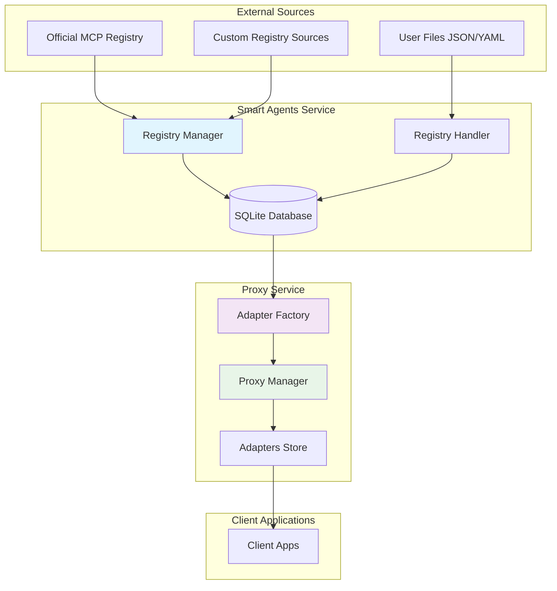
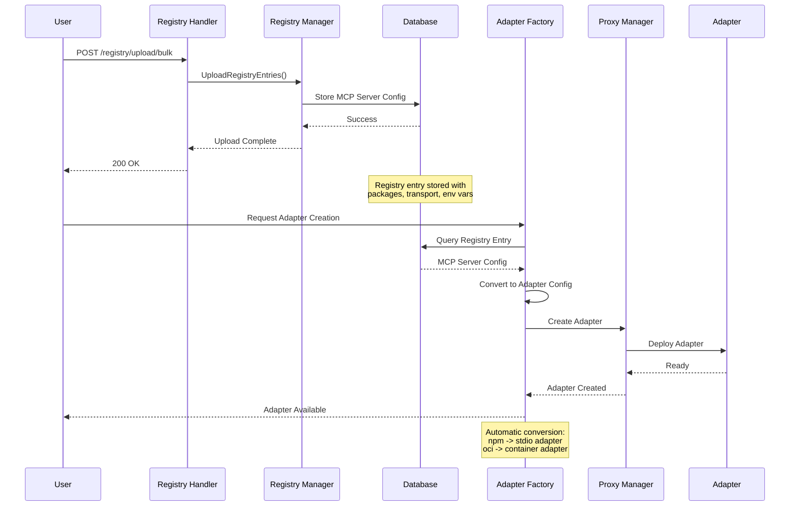
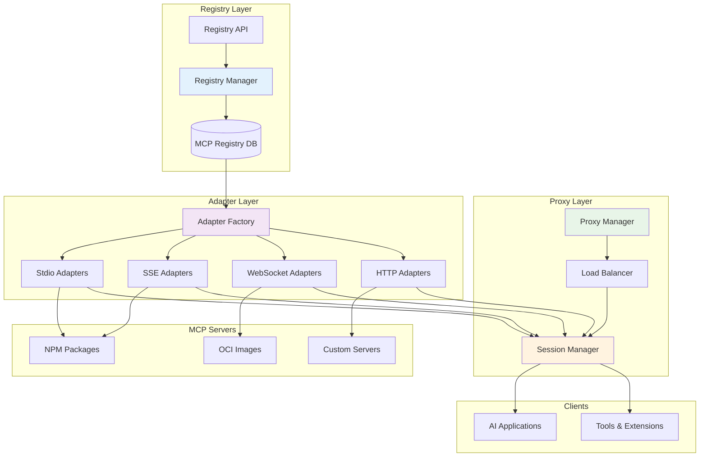

# MCP Registry Integration

The SUSE AI Universal Proxy includes comprehensive MCP Registry management capabilities, enabling seamless discovery, deployment, and management of MCP servers.

## Integration Status

✅ **New Registry System**: Fully integrated and operational
🔄 **Legacy Registry**: Enhanced with new capabilities, maintained for backward compatibility
📅 **Deprecation Timeline**: Legacy simple endpoints will be deprecated in a future release

## Migration Guide

### For New Implementations
Use the new registry endpoints for all MCP server management:

- `POST /registry/upload/bulk` - Preferred for bulk operations
- `GET /registry/browse` - Advanced search and filtering
- `POST /registry/upload` - Single server uploads

### For Existing Implementations
The legacy endpoints continue to work but now support enhanced data models:

- `POST /registry` - Now supports packages, environment variables, and metadata
- `GET /registry` - Now includes search and filtering capabilities
- All existing functionality is preserved

## Key Features

- **Registry Synchronization**: Automatic sync with the official MCP registry and support for custom registry sources
- **Bulk Upload**: Upload MCP server configurations from JSON/YAML files for custom deployments
- **Advanced Search**: Search and filter MCP servers by name, provider, transport type, and metadata
- **Adapter Auto-Generation**: Automatic conversion of registry entries to deployable proxy adapters
- **Multi-Source Support**: Combine official registry data with private/custom MCP server catalogs

## Registry API Endpoints

- `POST /registry/upload` - Upload a single MCP server configuration
- `POST /registry/upload/bulk` - Bulk upload multiple MCP server configurations
- `GET /registry/browse` - Search and browse available MCP servers with filtering options

## Usage Examples

```bash
# Upload a custom MCP server configuration
curl -X POST http://localhost:8910/registry/upload/bulk \
  -H "Content-Type: application/json" \
  -d @custom-mcp-servers.json

# Browse available MCP servers
curl "http://localhost:8910/registry/browse?query=filesystem&transport=stdio"
```

Registry configurations support OCI images, npm packages, and various transport types (stdio, SSE, WebSocket) with full environment variable and metadata management.

## MCP Server Configuration Format

```json
{
  "id": "filesystem-server",
  "name": "File System Server",
  "description": "Provides file system access capabilities",
  "version": "1.0.0",
  "packages": [
    {
      "registryType": "npm",
      "identifier": "@modelcontextprotocol/server-filesystem",
      "transport": {
        "type": "stdio"
      },
      "environmentVariables": [
        {
          "name": "ALLOWED_DIRS",
          "description": "Comma-separated list of allowed directories",
          "default": "/tmp"
        }
      ]
    }
  ],
  "_meta": {
    "author": "anthropic",
    "tags": ["filesystem", "utility"]
  }
}
```

## Architecture Overview

### Registry and Proxy Integration Flow



### Registry to Adapter Creation Flow



### Registry, Proxy, and Adapters Architecture



## Configuration

### Environment Variables

```bash
# Enable official MCP registry synchronization
export MCP_REGISTRY_ENABLE_OFFICIAL=true

# Sync interval for official registry (default: 24h)
export MCP_REGISTRY_SYNC_INTERVAL=24h

# Custom registry sources (comma-separated URLs)
export MCP_REGISTRY_CUSTOM_SOURCES="https://my-registry.example.com/v0/servers,https://private-registry.company.com/api/v1/mcp"
```

### Registry Manager Configuration

The Registry Manager supports multiple synchronization strategies:

- **Official Registry**: Automatic sync with `https://registry.modelcontextprotocol.io/v0/servers`
- **Custom Sources**: HTTP/HTTPS endpoints providing MCP server catalogs
- **File Sources**: Local JSON/YAML files for air-gapped deployments
- **Bulk Upload**: Runtime configuration upload via API

## Data Model

### MCPServer Structure

```go
type MCPServer struct {
    ID               string                 `json:"id"`
    Name             string                 `json:"name"`
    Description      string                 `json:"description"`
    Repository       *Repository            `json:"repository,omitempty"`
    Version          string                 `json:"version,omitempty"`
    Packages         []Package              `json:"packages,omitempty"`
    ValidationStatus string                 `json:"validation_status"`
    DiscoveredAt     time.Time              `json:"discovered_at"`
    Tools            []MCPTool              `json:"tools,omitempty"`
    Meta             map[string]interface{} `json:"_meta,omitempty"`
    URL              string                 `json:"url,omitempty"`
    Protocol         string                 `json:"protocol,omitempty"`
}
```

### Package Types

- **npm**: Node.js packages from npm registry
- **oci**: Container images from OCI registries (Docker Hub, etc.)
- **custom**: Custom deployment configurations

### Transport Types

- **stdio**: Standard input/output communication
- **sse**: Server-sent events for real-time updates
- **websocket**: Bidirectional WebSocket communication
- **http**: RESTful HTTP endpoints

## Migration Guide

### ⚠️ Deprecation Notice

**Legacy registry endpoints are deprecated and will be removed in a future major release.**

### Migration Timeline
- **Current**: Legacy endpoints still functional with deprecation warnings
- **Release N+1**: Legacy endpoints frozen (no new features)
- **Release N+2**: Legacy validation removed, new format required
- **Release N+3**: Legacy endpoints removed entirely

### Migrating from Legacy Endpoints

#### Before (Legacy - Deprecated)
```bash
# Simple server creation
curl -X POST http://localhost:8910/registry \
  -H "Content-Type: application/json" \
  -d '{
    "name": "My Server",
    "description": "A simple MCP server",
    "url": "http://localhost:8000/sse",
    "protocol": "sse"
  }'

# Basic listing
curl http://localhost:8910/registry
```

#### After (New - Recommended)
```bash
# Enhanced server creation with packages
curl -X POST http://localhost:8910/registry/upload/bulk \
  -H "Content-Type: application/json" \
  -d '[{
    "name": "My Server",
    "description": "An enhanced MCP server",
    "packages": [{
      "registryType": "npm",
      "identifier": "@modelcontextprotocol/server-filesystem",
      "transport": {"type": "stdio"},
      "environmentVariables": [{
        "name": "ALLOWED_DIRS",
        "default": "/tmp"
      }]
    }],
    "_meta": {
      "author": "myorg",
      "version": "1.0.0"
    }
  }]'

# Advanced search and filtering
curl "http://localhost:8910/registry/browse?transport=stdio&registryType=npm"
```

### Data Model Migration

#### Legacy Format (Deprecated)
```json
{
  "name": "Server Name",
  "description": "Description",
  "url": "http://example.com/sse",
  "protocol": "sse"
}
```

#### New Format (Required)
```json
{
  "name": "Server Name",
  "description": "Description",
  "version": "1.0.0",
  "packages": [{
    "registryType": "npm",
    "identifier": "@org/package",
    "transport": {"type": "stdio"},
    "environmentVariables": [{
      "name": "VAR_NAME",
      "default": "value"
    }]
  }],
  "_meta": {
    "author": "org",
    "tags": ["tag1", "tag2"]
  }
}
```

### Migration Tools

#### Automated Conversion Script
```bash
#!/bin/bash
# Convert legacy MCP server configs to new format

convert_legacy_config() {
  local input_file=$1
  local output_file=$2

  # Use jq to transform legacy format to new format
  jq '{
    name: .name,
    description: .description,
    version: "1.0.0",
    packages: [{
      registryType: "custom",
      identifier: (.name | gsub("[^a-zA-Z0-9]"; "-") | ascii_downcase),
      transport: {type: (.protocol // "stdio")},
      environmentVariables: []
    }],
    _meta: {
      migrated: true,
      original_url: .url,
      original_protocol: .protocol
    }
  }' "$input_file" > "$output_file"
}

# Usage: ./convert.sh legacy-config.json new-config.json
convert_legacy_config "$1" "$2"
```

#### Bulk Migration
```bash
# Convert all legacy configs in a directory
for file in legacy/*.json; do
  new_file="new/$(basename "$file")"
  ./convert.sh "$file" "$new_file"
done

# Upload all converted configs
for file in new/*.json; do
  curl -X POST http://localhost:8910/registry/upload/bulk \
    -H "Content-Type: application/json" \
    -d "@$file"
done
```

## Integration Examples

### Uploading Custom MCP Servers

```bash
# Upload from JSON file (recommended)
curl -X POST http://localhost:8910/registry/upload/bulk \
  -H "Content-Type: application/json" \
  -d @my-mcp-servers.json

# Upload single server (recommended)
curl -X POST http://localhost:8910/registry/upload \
  -H "Content-Type: application/json" \
  -d '{"id":"my-server","name":"My Server","packages":[{"registryType":"npm","identifier":"@myorg/mcp-server"}]}'
```

### Browsing and Filtering

```bash
# Get all servers (recommended)
curl http://localhost:8910/registry/browse

# Filter by transport type (recommended)
curl "http://localhost:8910/registry/browse?transport=stdio"

# Search by name (recommended)
curl "http://localhost:8910/registry/browse?query=filesystem"

# Filter by registry type (recommended)
curl "http://localhost:8910/registry/browse?registryType=npm"
```

### Legacy Endpoints (Deprecated - Do Not Use for New Code)

```bash
# These will show deprecation warnings
curl -X POST http://localhost:8910/registry \
  -H "Content-Type: application/json" \
  -d '{"name":"server","url":"http://example.com","protocol":"sse"}'

curl http://localhost:8910/registry
```

### Automatic Adapter Creation

When a registry entry is uploaded, the system automatically:

1. Parses the package configuration
2. Determines the appropriate adapter type based on transport
3. Creates the adapter configuration
4. Deploys the adapter to the proxy
5. Makes it available for client connections

This seamless integration enables users to deploy MCP servers with minimal configuration, while maintaining full control over deployment parameters and environment settings.