# SUSE AI Virtual MCP Service - Overview

The SUSE AI Virtual MCP Service enables the creation of Model Context Protocol (MCP) servers from existing APIs and databases without requiring any code development. This service bridges the gap between legacy applications and modern AI systems by standardizing how endpoints are presented to Large Language Models (LLMs).

## What is Virtual MCP?

Virtual MCP is a code-free MCP server generation service that transforms existing application interfaces into standardized MCP servers. Instead of writing custom MCP server code, users can simply provide OpenAPI schemas or database connection details, and Virtual MCP automatically generates fully functional MCP servers.

## Key Features

### 🔄 API Schema Conversion
- **OpenAPI Support**: Convert REST API specifications (OpenAPI/Swagger) into MCP servers
- **Automatic Mapping**: Intelligent mapping of HTTP endpoints to MCP tools and resources
- **Schema Validation**: Built-in validation of API schemas and generated MCP interfaces

### 🗄️ Database Integration
- **SQL Database Support**: Generate MCP servers from database schemas
- **Query Generation**: Automatic creation of database query tools
- **Schema Discovery**: Dynamic discovery of database tables, views, and relationships

### 🚫 Code-Free Generation
- **No Development Required**: Generate MCP servers without writing any code
- **Configuration-Driven**: Simple configuration files define the generation process
- **Hot Reloading**: Automatic regeneration when source schemas change

### 🔗 Legacy Application Integration
- **Existing API Consumption**: Connect legacy REST APIs to LLMs without modification
- **Database Access**: Provide LLMs with direct database query capabilities
- **Standardized Interface**: All legacy systems appear as standardized MCP servers

## How It Works

### API Schema Conversion Process

```mermaid
graph TD
    A[OpenAPI Schema<br/>JSON/YAML] --> B[Schema Parser<br/>Validation & Analysis]
    B --> C[Endpoint Mapping<br/>HTTP → MCP Tools]
    C --> D[Resource Discovery<br/>API Resources → MCP Resources]
    D --> E[MCP Server Generation<br/>Code & Configuration]
    E --> F[Running MCP Server<br/>Ready for LLM Consumption]
```



### Database Integration Process


## Use Cases

### Enterprise API Integration
- **Legacy System Access**: Connect existing REST APIs to modern AI applications
- **API Standardization**: Present diverse APIs through a unified MCP interface
- **Rapid Prototyping**: Quickly create MCP servers for proof-of-concepts

### Database-Driven AI Applications
- **Data Analysis**: Enable LLMs to query databases directly
- **Report Generation**: Generate reports using natural language queries
- **Data Insights**: Provide AI-powered data exploration capabilities

### Development Workflow Integration
- **API Testing**: Use LLMs to test and validate API endpoints
- **Documentation Generation**: Auto-generate API documentation through AI interaction
- **Code Generation**: Generate code based on API and database schemas

## Architecture

### Service Components

```
Virtual MCP Service
├── Schema Parser
│   ├── OpenAPI Processor
│   ├── Database Schema Analyzer
│   └── Configuration Validator
├── MCP Generator
│   ├── Tool Generator
│   ├── Resource Generator
│   └── Server Template Engine
├── Runtime Manager
│   ├── Server Lifecycle
│   ├── Health Monitoring
│   └── Configuration Updates
└── Registry Integration
    ├── Auto-Registration
    ├── Metadata Management
    └── Discovery Services
```

### Integration with Proxy Ecosystem

Virtual MCP integrates seamlessly with the SUSE AI Universal Proxy ecosystem:

- **Proxy Registration**: Automatically registers generated MCP servers with the proxy
- **Load Balancing**: Generated servers benefit from proxy load balancing
- **Health Monitoring**: Proxy monitors health of generated servers
- **Service Discovery**: Generated servers are discoverable through the registry

## Configuration

### OpenAPI Schema Configuration

```yaml
virtualmcp:
  name: "petstore-api"
  type: "openapi"
  source:
    url: "https://petstore.swagger.io/v2/swagger.json"
    format: "openapi-v2"
  generation:
    tools:
      - path: "/pets"
        methods: ["GET", "POST"]
        tool_name: "manage_pets"
    resources:
      - path: "/pets/{id}"
        resource_name: "pet_details"
  authentication:
    type: "bearer"
    token_env: "PETSTORE_API_TOKEN"
```

### Database Configuration

```yaml
virtualmcp:
  name: "company-database"
  type: "database"
  source:
    connection:
      type: "postgresql"
      host: "db.company.com"
      port: 5432
      database: "analytics"
      username_env: "DB_USER"
      password_env: "DB_PASSWORD"
    ssl_mode: "require"
  generation:
    tables:
      - name: "users"
        tools: ["select", "insert", "update"]
      - name: "orders"
        tools: ["select", "analytics"]
    queries:
      - name: "monthly_revenue"
        sql: "SELECT SUM(amount) FROM orders WHERE created_at >= ?"
        parameters:
          - name: "start_date"
            type: "date"
```

## Generated MCP Server Features

### Automatic Tool Generation
- **CRUD Operations**: Create, Read, Update, Delete tools for API endpoints
- **Custom Queries**: Domain-specific query tools based on schema analysis
- **Batch Operations**: Bulk operation tools for efficiency

### Resource Management
- **Dynamic Resources**: Resources that reflect current API/database state
- **Subscription Support**: Real-time updates for changing data
- **Caching**: Intelligent caching to reduce API/database load

### Error Handling
- **Graceful Degradation**: Continues operation when source systems are unavailable
- **Retry Logic**: Automatic retry for transient failures
- **Error Translation**: Meaningful error messages for LLM consumption

## Security Considerations

### Data Protection
- **Access Control**: Configurable access controls for generated tools
- **Data Sanitization**: Automatic sanitization of sensitive data
- **Audit Logging**: Complete audit trail of all operations

### Authentication
- **Token Management**: Secure handling of API tokens and database credentials
- **OAuth Support**: Integration with OAuth flows for API authentication
- **Credential Rotation**: Support for automatic credential rotation

### Network Security
- **TLS Encryption**: All communications use TLS encryption
- **Firewall Integration**: Respects network security policies
- **Rate Limiting**: Protection against abuse and excessive API calls

## Performance & Scalability

### Optimization Features
- **Connection Pooling**: Efficient database connection management
- **Query Optimization**: Automatic optimization of generated queries
- **Caching Layer**: Intelligent caching to reduce source system load

### Monitoring & Observability
- **Metrics Collection**: Comprehensive performance metrics
- **Health Checks**: Automated health monitoring of generated servers
- **Logging**: Structured logging for debugging and analysis

## Future Enhancements

### Planned Features
- **GraphQL Support**: Generate MCP servers from GraphQL schemas
- **Webhook Integration**: Real-time data push capabilities
- **Advanced Analytics**: AI-powered query optimization
- **Multi-Source Aggregation**: Combine multiple APIs into single MCP servers

### Technology Roadmap
- **WebAssembly Support**: Run generated servers in WebAssembly environments
- **Edge Computing**: Deploy generated servers at the edge
- **AI-Powered Generation**: Use AI to optimize generated MCP server interfaces

This service represents a significant advancement in making existing applications accessible to AI systems, enabling organizations to leverage their existing investments in APIs and databases within modern AI workflows.